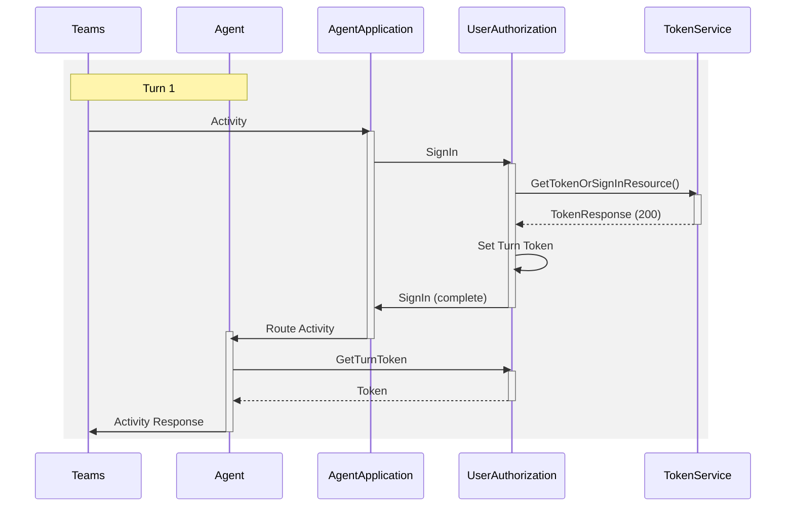
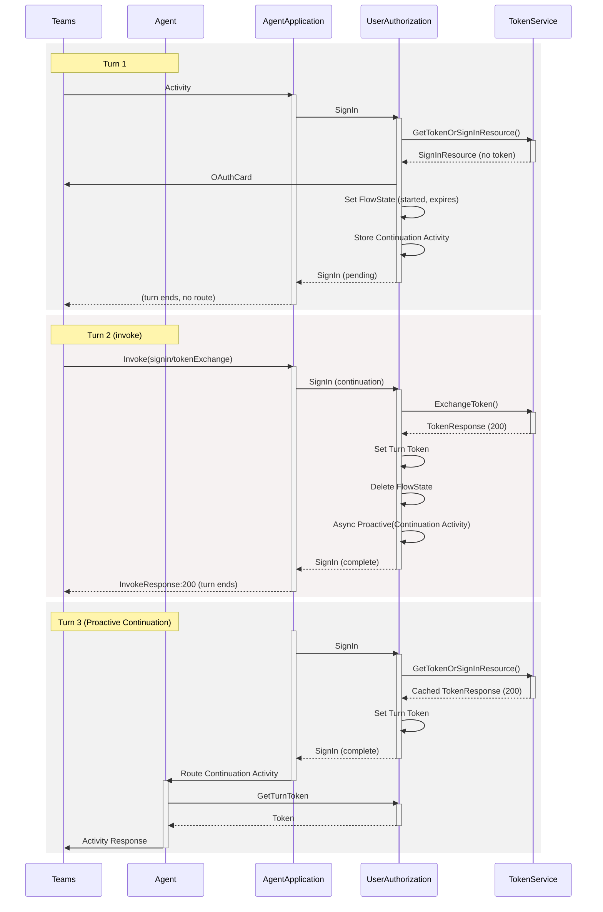
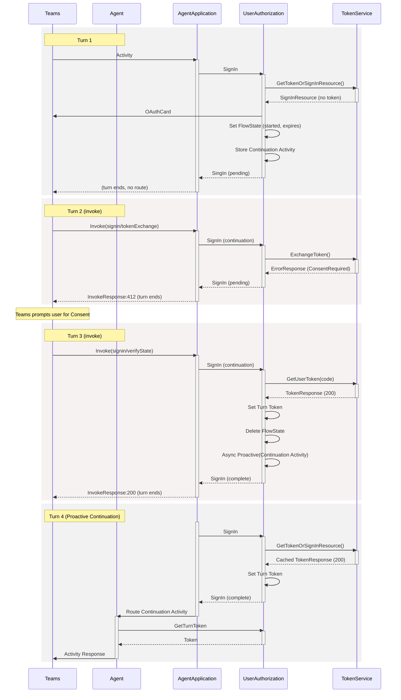
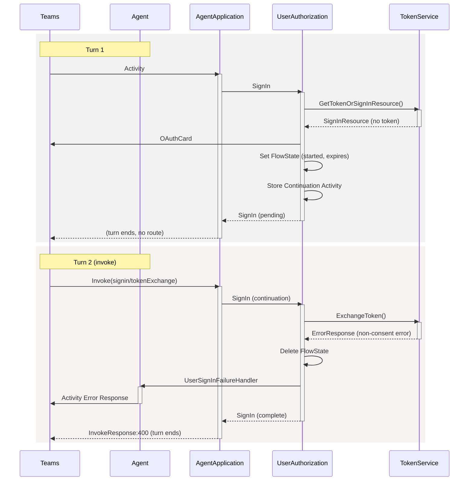

# Teams SSO (non-Agentic) OAuth flow via DotNet AgentApplication

- **Teams** is the Teams backend (SMBA).
- **Agent** is the business logic for the Agent.  The customers code.
- **AgentApplication** is SDK provided application logic.
- **UserAuthorization** is SDK provided OAuth flow logic.
- **Token Service** is the Azure Token Service.
  - Note that the DotNet Token Service Client caches successful tokens from `GetTokenOrSignInResource`.  While the diagrams indicate requests, cached values would instead be used when available.

## SignedIn
This represents a single-turn token acquisition as a result of the user having already signed into the Token Service in the past. If OBO is configured, the OBO is performed on the token returned by the Token Service prior to setting the Turn Token.

## SignIn, No ConsentRequired
This represents the signin flow, which is a multi-turn operation, where no user consent is required. If OBO is configured, the OBO is performed on the token returned by the Token Service (in `Turn 2`) prior to setting the Turn Token. Note that `Turn 3` is the same flow as `SignedIn` above.

## SignIn, ConsentRequired
This represents the signin flow where Teams SSO token exchange fails because the user hasn't consented. Teams prompts for consent, then sends a verifyState invoke with a magic code. If OBO is configured, the OBO is performed on the token returned by the Token Service (in `Turn 3`) prior to setting the Turn Token. Note that `Turn 4` is the same flow as `SignedIn` above.

## SignIn, Exchange failure
This represents a critical failure during token exchange (not ConsentRequired). For example, a misconfigured OAuth connection or a Token Service outage. Teams will not retry after receiving a 400.

