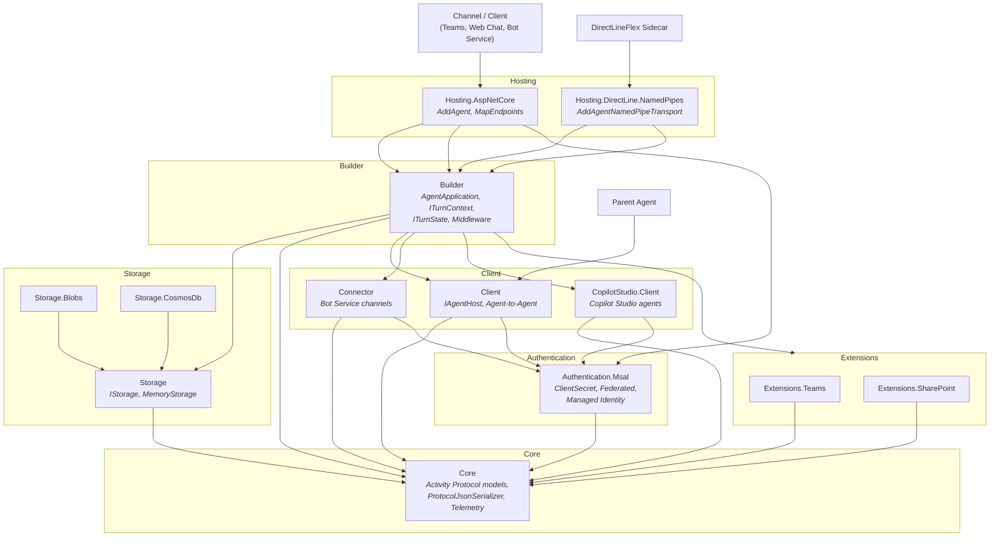

# SDK Architecture

High-level system diagram showing the layered library structure and their relationships.

## Diagram

## Layer Summary

| Layer | Purpose |
|-------|---------|
| **Hosting** | Receives inbound HTTP or named-pipe requests and dispatches to the agent |
| **Builder** | Agent construction, route-based handler registration, middleware pipeline |
| **Client** | Outbound communication — Agent-to-Agent, Bot Service channels, Copilot Studio |
| **Extensions** | Platform-specific capabilities (Teams, SharePoint) |
| **Storage** | State persistence (memory, Blob, CosmosDb) |
| **Authentication** | Token acquisition via MSAL (secrets, federated creds, managed identity) |
| **Core** | Activity Protocol models, serialization, telemetry — foundation for all layers |
