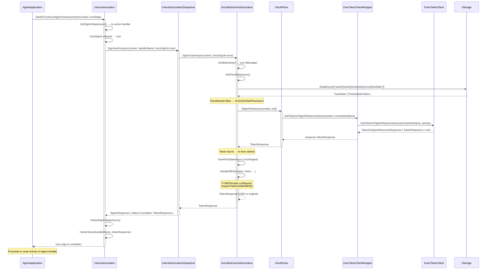
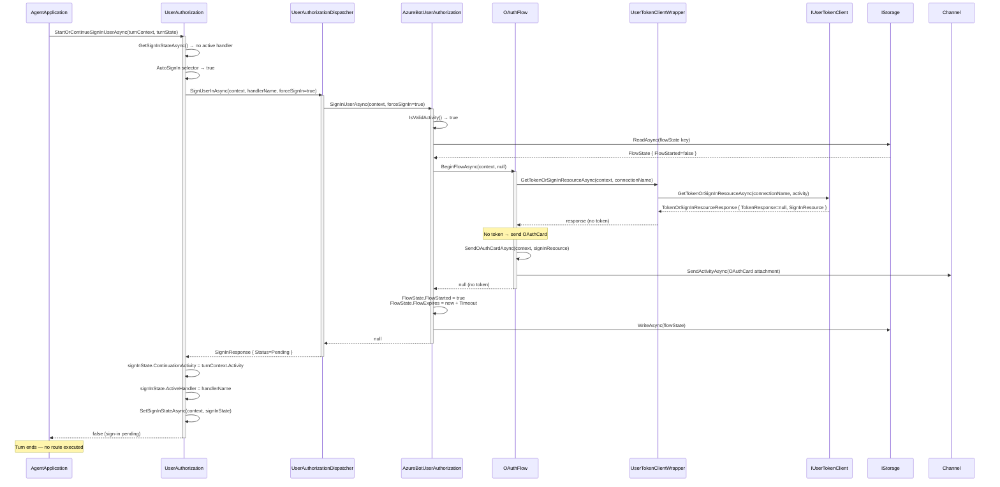
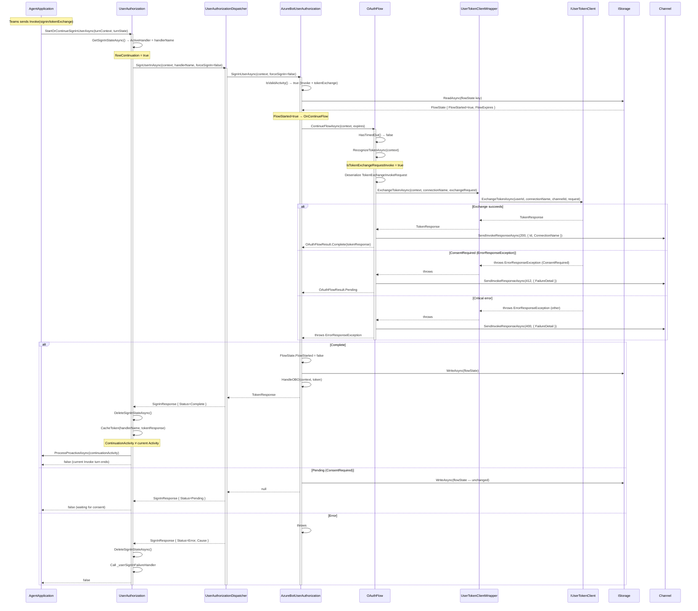
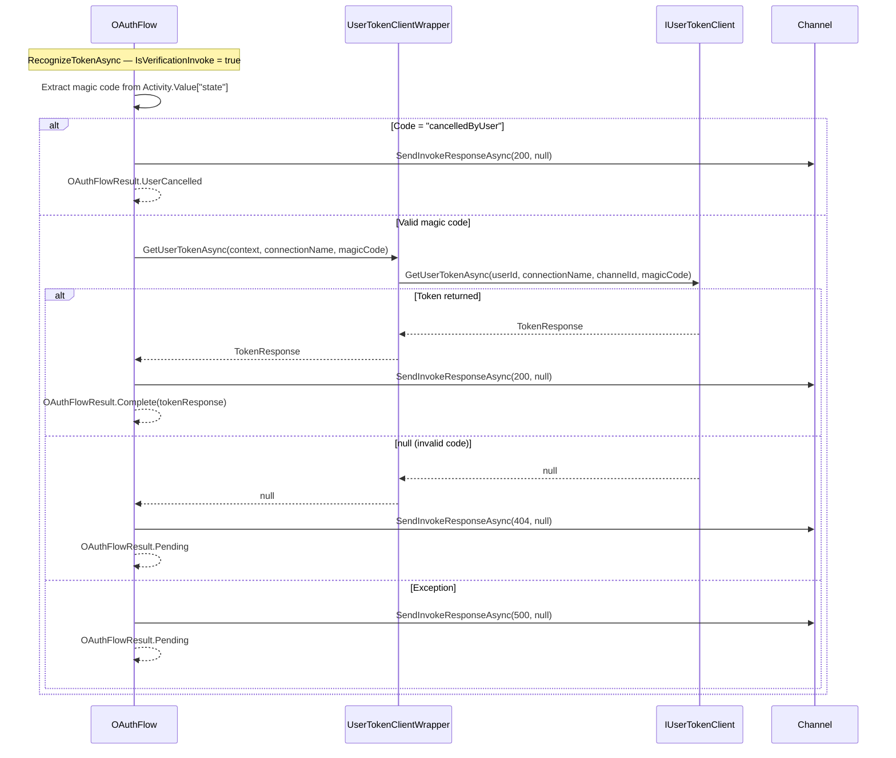
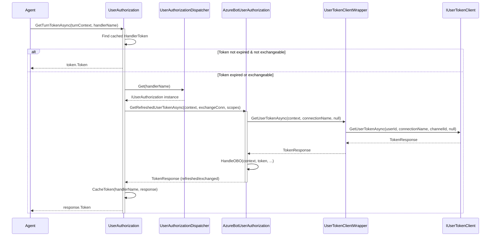

# Detailed OAuth Internal Sequence Diagram

Shows the detailed internal flow from `AgentApplication` through `UserAuthorization`, `UserAuthorizationDispatcher`, `AzureBotUserAuthorization`, `OAuthFlow`, and `IUserTokenClient`. This complements the high-level `teams-sso-sequence-diagram.md` with implementation-level detail.

## Participants

- **AgentApplication** — SDK entry point; calls `UserAuthorization.StartOrContinueSignInUserAsync` each turn.
- **UserAuthorization** — Manages sign-in state (continuation activity, active handler), caches tokens, handles OBO exchange dispatch.
- **UserAuthorizationDispatcher** — Routes to named `IUserAuthorization` instances (loaded from config or DI).
- **AzureBotUserAuthorization** — Implements `IUserAuthorization` for Azure Bot Token Service. Manages `FlowState` in `IStorage`.
- **OAuthFlow** — Low-level protocol logic: `BeginFlowAsync` / `ContinueFlowAsync`. Handles OAuthCard sending, token exchange, magic code, and invoke responses.
- **UserTokenClientWrapper** — Static façade over `IUserTokenClient` (resolved from `ITurnContext.Services`).
- **IUserTokenClient** — Interface to Azure Token Service (implemented by connector layer).
- **IStorage** — Persists `FlowState` (flow started, expires, continue count) and sign-in state.
- **OBOExchange** — Base class for On-Behalf-Of token exchange via `IConnections`.

## Flow 1: First Turn — Token Cached (Already Signed In)

## Flow 2: First Turn — Token Not Cached (Flow Starts)

## Flow 3: Continuation Turn — Token Exchange (signin/tokenExchange)

## Flow 4: Continuation Turn — Verify State (signin/verifyState with magic code)

## Flow 5: GetTurnTokenAsync (Agent retrieves cached token)

## Key Classes & Responsibilities

| Class | Responsibility | Path |
|-------|---------------|------|
| `UserAuthorization` | Sign-in state machine, token cache, proactive continuation | `src/libraries/Builder/Microsoft.Agents.Builder/App/UserAuth/UserAuthorization.cs` |
| `UserAuthorizationDispatcher` | Named handler registry, type loading from config | `src/libraries/Builder/Microsoft.Agents.Builder/UserAuth/UserAuthorizationDispatcher.cs` |
| `AzureBotUserAuthorization` | `IUserAuthorization` for Azure Token Service, FlowState persistence | `src/libraries/Builder/Microsoft.Agents.Builder/UserAuth/TokenService/AzureBotUserAuthorization.cs` |
| `OAuthFlow` | Protocol-level: OAuthCard, token exchange, magic code, invoke responses | `src/libraries/Builder/Microsoft.Agents.Builder/UserAuth/TokenService/OAuthFlow.cs` |
| `UserTokenClientWrapper` | Static façade over `IUserTokenClient` from turn services | `src/libraries/Builder/Microsoft.Agents.Builder/UserAuth/TokenService/UserTokenClientWrapper.cs` |
| `IUserTokenClient` | Azure Token Service interface (GetToken, Exchange, SignOut) | `src/libraries/Connector/Microsoft.Agents.Connector/IUserTokenClient.cs` |
| `OBOExchange` | On-Behalf-Of exchange via `IConnections` / `IOBOExchange` | `src/libraries/Builder/Microsoft.Agents.Builder/UserAuth/OBOExchange.cs` |
| `FlowState` | Persisted state: FlowStarted, FlowExpires, ContinueCount | `src/libraries/Builder/Microsoft.Agents.Builder/UserAuth/TokenService/AzureBotUserAuthorization.cs` |

## Storage Keys

- **FlowState**: `oauth/{handlerName}/{channelId}/{conversationId}/flowState`
- **SignInState**: Managed by `UserAuthorization` via `ITurnState` (conversation-scoped)

## Important Behaviors

- **AutoSignIn**: If enabled (default), `StartOrContinueSignInUserAsync` is called every turn before route matching. If the user has a cached token, this is a fast path (single Token Service call).
- **Continuation Activity**: When a multi-turn flow starts, the original user message is banked. After sign-in completes on a different turn (Invoke), the banked activity is replayed via `ProcessProactiveAsync`.
- **Invoke Response Codes**: `200` = success, `412` = consent required (Teams retries with consent), `400` = critical failure (Teams stops), `404` = invalid magic code, `500` = retriable error.
- **Timeout**: `OAuthSettings.Timeout` (default from `OAuthSettings.DefaultTimeoutValue`). After expiry, all invokes return errors.
- **InvalidSignInRetryMax**: Non-tokenExchange continuations (e.g., bad magic codes) are retried up to this limit before throwing `AuthExceptionReason.InvalidSignIn`.
- **OBO**: Performed after every successful token acquisition (BeginFlow cached token, ContinueFlow token, GetRefreshedUserToken). Uses `IConnections` to resolve an `IOBOExchange` provider.
