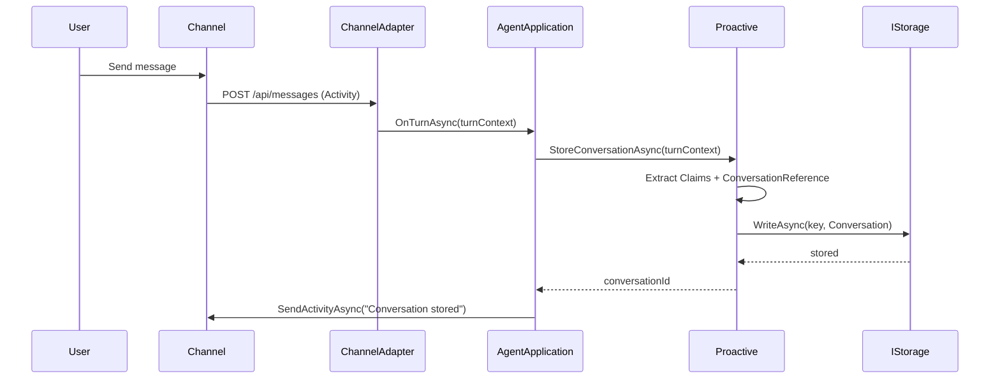
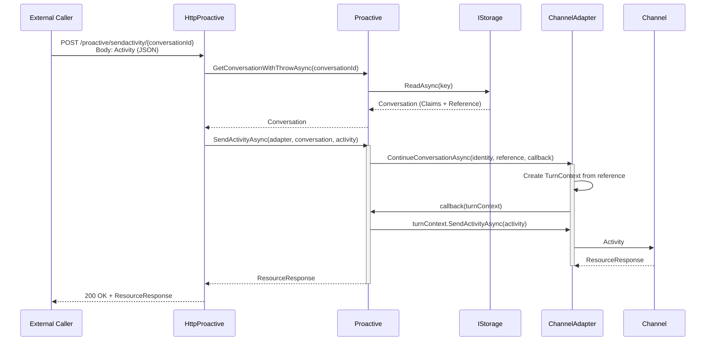
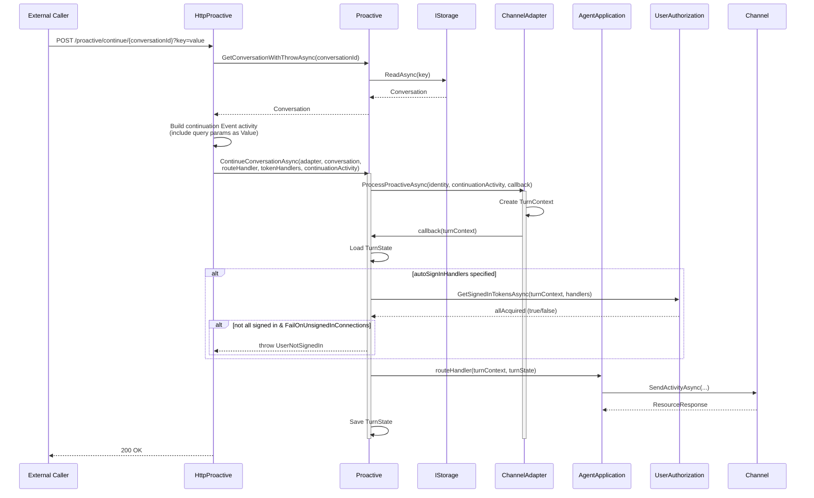
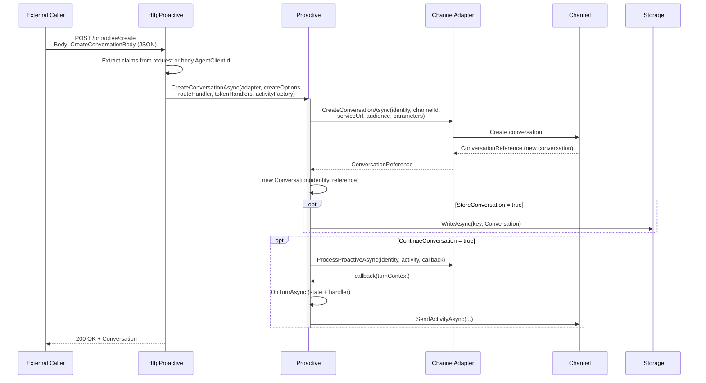
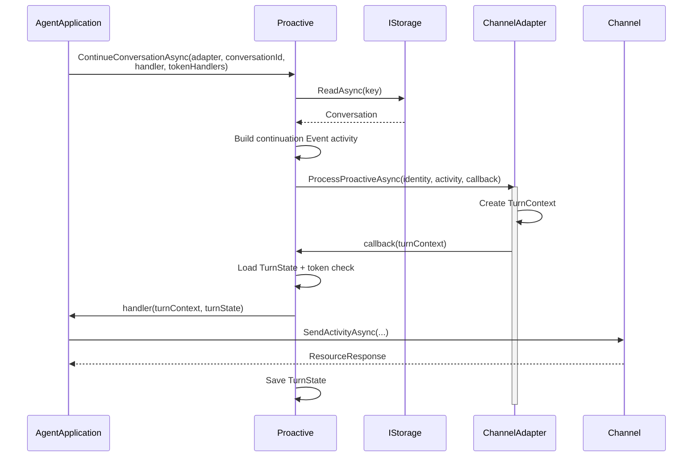

# Proactive Messaging Sequence Diagram

Shows how agents can initiate messages to users outside the normal request/response flow. Proactive messaging enables notifications, scheduled alerts, and external-trigger scenarios using stored conversation references.

## Participants

- **External Caller** — An external system (webhook, timer, API client) that triggers proactive messaging via HTTP.
- **HttpProactive** — ASP.NET Core endpoint handler that processes proactive HTTP requests.
- **AgentApplication** — The customer's agent, exposing `Proactive` property.
- **Proactive** — SDK class that manages conversation storage and proactive operations.
- **IStorage** — Persistence layer for conversation references (MemoryStorage, Blob, CosmosDb).
- **ChannelAdapter** — Adapter that creates turn contexts and sends activities to the channel.
- **Channel** — The upstream channel (Teams, WebChat, DirectLine, etc.).

## Flow 1: Store Conversation Reference

Before proactive messaging can work, the conversation must be stored during a normal user-initiated turn.

## Flow 2: SendActivity via HTTP (with stored conversationId)

An external system sends an activity to a previously stored conversation.

## Flow 3: ContinueConversation via HTTP

An external system triggers a registered `[ContinueConversation]` handler, which runs full agent logic (state, token handling) within the stored conversation context.

## Flow 4: CreateConversation via HTTP

Creates a new conversation (e.g., 1:1 with a user in Teams) and optionally continues into it.

## Flow 5: In-Code Proactive (no HTTP endpoint)

An agent triggers proactive messaging from within its own turn logic (e.g., notifying another conversation).

## HTTP Endpoint Summary

| Endpoint | Method | Description |
|----------|--------|-------------|
| `/proactive/sendactivity/{conversationId}` | POST | Send an activity to a stored conversation by ID |
| `/proactive/sendactivity` | POST | Send an activity with a full `Conversation` object in body |
| `/proactive/continue/{conversationId}` | POST | Continue a stored conversation using the default `[ContinueConversation]` handler |
| `/proactive/continue/{key}/{conversationId}` | POST | Continue using a named handler (e.g., `/continue/ext/{id}`) |
| `/proactive/continue` | POST | Continue with a full `Conversation` object in body |
| `/proactive/continue/{key}` | POST | Continue (named) with a full `Conversation` object in body |
| `/proactive/create` | POST | Create a new conversation and optionally continue into it |
| `/proactive/create/{key}` | POST | Create using a named handler |

## Key Implementation Details

- **Conversation** — A record containing `ConversationReference` + `Claims` (JWT claims for identity reconstruction). Serializable for storage.
- **ConversationBuilder** — Fluent builder for manually constructing `Conversation` instances without an existing `ITurnContext`.
- **ProcessProactiveAsync** vs **ContinueConversationAsync** — `ProcessProactiveAsync` creates a full turn pipeline (middleware, state); `ContinueConversationAsync` (on adapter) is simpler and only provides a TurnContext callback.
- **Token Handling** — `[ContinueConversation(autoSignInHandlers: "me")]` automatically retrieves user tokens during proactive turns. If the user hasn't signed in, `UserNotSignedIn` is thrown.
- **Exception Capture** — Exceptions inside the proactive callback are captured via `ExceptionDispatchInfo` and re-thrown after the adapter completes, since they would otherwise be lost.
- **Query Parameters** — HTTP continue endpoints pass query string values as `Activity.Value` with `ValueType = "application/vnd.microsoft.activity.continueconversation+json"`.
- **Storage Key** — Conversations are stored under `proactive/conversations/{conversationId}`.

## Related Source Files

| Component | Path |
|-----------|------|
| Proactive | `src/libraries/Builder/Microsoft.Agents.Builder/App/Proactive/Proactive.cs` |
| Conversation | `src/libraries/Builder/Microsoft.Agents.Builder/App/Proactive/Conversation.cs` |
| ConversationBuilder | `src/libraries/Builder/Microsoft.Agents.Builder/App/Proactive/ConversationBuilder.cs` |
| ContinueConversationAttribute | `src/libraries/Builder/Microsoft.Agents.Builder/App/Proactive/ContinueConversationAttribute.cs` |
| ContinueConversationRoute | `src/libraries/Builder/Microsoft.Agents.Builder/App/Proactive/ContinueConversationRoute.cs` |
| CreateConversationOptions | `src/libraries/Builder/Microsoft.Agents.Builder/App/Proactive/CreateConversationOptions.cs` |
| CreateConversationOptionsBuilder | `src/libraries/Builder/Microsoft.Agents.Builder/App/Proactive/CreateConversationOptionsBuilder.cs` |
| ProactiveOptions | `src/libraries/Builder/Microsoft.Agents.Builder/App/Proactive/ProactiveOptions.cs` |
| HttpProactive (endpoint handler) | `src/libraries/Hosting/AspNetCore/HttpProactive.cs` |
| AgentEndpointExtensions (MapAgentProactiveEndpoints) | `src/libraries/Hosting/AspNetCore/AgentEndpointExtensions.cs` |
| Proactive Sample | `src/samples/Proactive/ProactiveAgent.cs` |
| Proactive Sample Startup | `src/samples/Proactive/Program.cs` |
