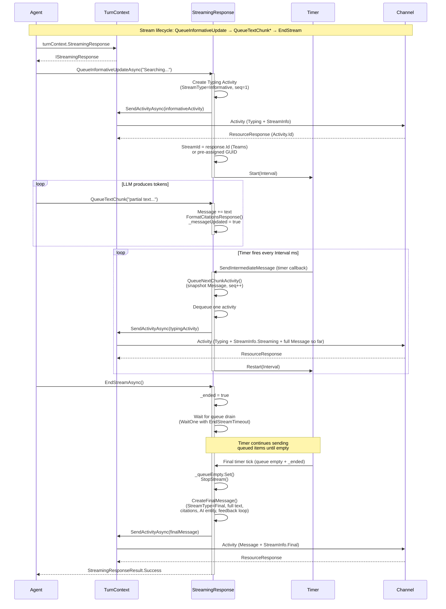
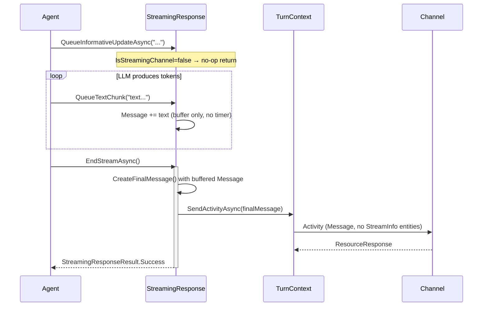
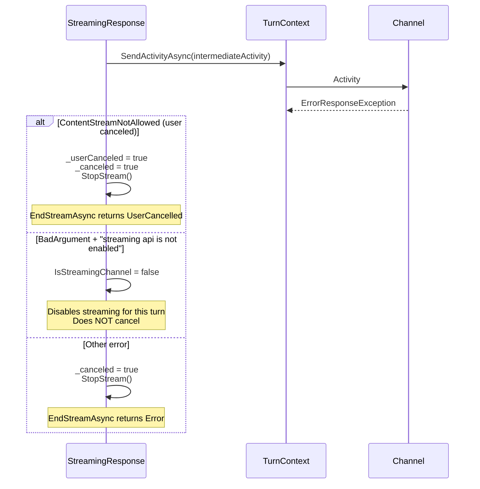

# StreamingResponse Sequence Diagram

Shows how `StreamingResponse` delivers chunked intermediate messages on a timer interval, giving the UX of a streamed message. When complete, a final `ActivityTypes.Message` is sent with the full text and optional attachments/citations.

## Participants

- **Agent** — The customer's business logic (or an LLM client producing chunks).
- **TurnContext** — Per-turn context; exposes `StreamingResponse` property.
- **StreamingResponse** — SDK-provided chunked message delivery (internal class).
- **Timer** — Internal `System.Threading.Timer` that fires at `Interval` ms.
- **Channel** — The upstream channel (Teams, WebChat, DirectLine, or Agent-to-Agent via SSE).

## Channel Defaults

| Channel | Interval | StreamId | Notes |
|---------|----------|----------|-------|
| Teams | 1000ms | Assigned by first response | MUST use Activity.Id from first send |
| WebChat / DirectLine | 500ms | Random GUID | |
| DeliveryMode.Stream (A2A) | 100ms | Random GUID | |
| Other / ExpectReplies | N/A | N/A | Non-streaming; buffers text, sends single final message |

## Streaming Channel Flow

## Non-Streaming Channel Flow

For channels that don't support intermediate messages (`IsStreamingChannel = false`), or `DeliveryMode.ExpectReplies`:

## Error Handling: User Cancellation & Teams Errors

## Key Implementation Details

- **Timer is one-shot, re-armed after each send** — prevents overlapping sends if `SendActivityAsync` takes longer than `Interval` (e.g., MSAL token refresh).
- **InitialDelay** (default 250ms) — used for the first `QueueTextChunk` if no informative was sent, enabling faster stream start.
- **Message accumulates** — each intermediate message sends the FULL text so far (not a delta). Channel displays latest as replacement.
- **StreamId** — Teams assigns it from first response; WebChat/DirectLine/A2A uses a pre-generated GUID set on every outgoing `Activity.Id`.
- **EndStreamTimeout** — defaults to 2 minutes. If queue doesn't drain in time, returns `Timeout`.
- **ResetAsync** — allows reusing `StreamingResponse` for multiple streams in the same turn (waits for current stream to end first).

## Related Source Files

| Component | Path |
|-----------|------|
| StreamingResponse | `src/libraries/Builder/Microsoft.Agents.Builder/StreamingResponse.cs` |
| IStreamingResponse | `src/libraries/Builder/Microsoft.Agents.Builder/IStreamingResponse.cs` |
| TurnContext (exposes StreamingResponse) | `src/libraries/Builder/Microsoft.Agents.Builder/TurnContext.cs` |
| StreamInfo entity | `src/libraries/Core/Microsoft.Agents.Core/Models/StreamInfo.cs` |
| StreamTypes constants | `src/libraries/Core/Microsoft.Agents.Core/Models/StreamTypes.cs` |
