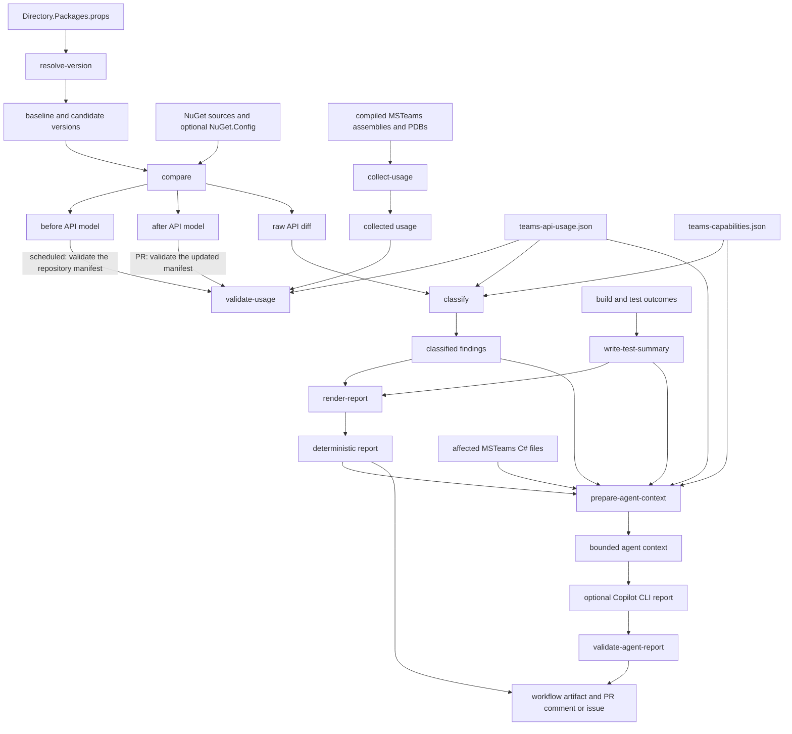

# Teams API Drift Detector — Technical Description

## Purpose

The Teams API Drift Detector identifies API changes between two versions of `Microsoft.Teams.Apps`, determines whether the MSTeams extension uses the affected APIs, and produces deterministic findings for maintainers. CI workflows can optionally give the same bounded evidence to Copilot CLI for an advisory report, but the deterministic findings remain authoritative.

The tool is a .NET command-line application in `scripts/TeamsApiDrift`. It reads NuGet package metadata without loading package assemblies into the running process.

## Component inventory

| Component | Responsibility |
| --- | --- |
| `Microsoft.Agents.TeamsApiDrift.csproj` | Builds the `net10.0` CLI and declares its NuGet metadata-reading dependencies. |
| `Program.cs` | Defines the CLI commands, parses arguments, coordinates services, writes outputs, and maps validation failures or exceptions to exit codes. |
| `Contracts.cs` | Defines the serialized contracts for API models, changes, usage data, findings, test summaries, and agent-report validation. |
| `MetadataApiExtractor.cs` | Downloads or resolves package versions, selects reference/implementation assets for supported target frameworks, and extracts the public API from assembly metadata. |
| `ComparisonAndUsage.cs` | Compares normalized API models, scans the compiled MSTeams assembly for dependency use, and validates collected use against the curated manifest. |
| `DriftPipeline.cs` | Resolves centrally managed package versions, classifies changes, renders reports, creates bounded agent context, and validates an agent-authored report. |
| `ToolUtilities.cs` | Supplies common argument, JSON, path-containment, hashing, and normalization helpers. |
| `teams-api-usage.json` | Curated inventory of the `Microsoft.Teams.Apps` symbols and members intentionally used by MSTeams, including exposure and affected source files. |
| `teams-capabilities.json` | Maps Teams namespaces and types to capability areas, owners, and additive-change adoption policies. |
| `copilot-instructions.md` | Constrains the optional Copilot report format, accepted evidence, required finding IDs, and advisory language. |
| `teams-api-drift-pr.yml` | Runs drift detection for package-version pull requests or manual PR-style comparisons, publishes artifacts, and updates an internal PR comment. |
| `teams-api-drift-scheduled.yml` | Compares the repository baseline with the latest stable package on a schedule or by manual dispatch and creates or updates an advisory issue. |
| `Microsoft.Agents.TeamsApiDrift.Tests` | Exercises package resolution, extraction, comparison, usage validation, classification, rendering, context generation, and report validation. |
| `TeamsApiContractTests.cs` | Compile-time contract coverage that detects source-level breaks in the APIs consumed by MSTeams. |
| `TeamsApiClientExtensionsTests.cs` | Runtime boundary tests for selected MSTeams-to-Teams API interactions. |

The two workflow files are under `.github/workflows`; the test projects and files are under `src/tests`.

## End-to-end data flow



The package comparison is always **baseline → candidate**:

- For a pull request, the baseline is the `Microsoft.Teams.Apps` version on the PR base branch and the candidate is the version being introduced by the PR.
- For a scheduled run, the baseline is the version currently used by `Microsoft.Agents.Extensions.MSTeams` and the candidate is the latest stable released version.

`validate-usage` is a separate manifest-integrity check; it does not compare package versions. It accepts one API model and verifies that `teams-api-usage.json` describes valid APIs for the repository state to which the manifest belongs. In a package-update PR, that repository state has moved to the candidate, so validation uses the `after` model. During a scheduled probe, the repository has not adopted the latest release and its manifest still declares the baseline version, so validation uses the `before` model. The scheduled workflow still compares, builds, and tests the baseline against the latest stable candidate.

## CLI commands

All commands write diagnostic errors to standard error. An unhandled command error returns exit code `2`. `validate-usage` and `validate-agent-report` return `1` for an invalid result; `classify --fail-on-drift` returns `1` for blocking or required findings. Successful commands return `0`.

| Command | Primary inputs | Output | Notes |
| --- | --- | --- | --- |
| `resolve-version` | `--props`, optionally `--package` | Resolved version on standard output | Reads `Directory.Packages.props` and follows MSBuild property indirection. `--props -` reads XML from standard input. |
| `compare` | `--from`, optional `--to`, `--output`, repeated `--source`, optional `--config-file` | Before model, after model, raw diff, and the resolved candidate version on standard output | When `--to` is omitted, selects the latest stable version found in the configured sources. |
| `collect-usage` | One or more `--assembly` values and `--output` | Collected dependency usage JSON | Uses assembly metadata and portable PDBs; it does not execute the MSTeams assembly. |
| `validate-usage` | `--manifest`, `--collected`, `--api-model`, optional `--repository-root`, `--output` | Usage-validation JSON | Checks package/version alignment, symbol/member existence, source paths, PDB evidence, exposure, and stale or missing manifest entries. |
| `classify` | `--comparison`, `--manifest`, `--capabilities`, `--output`, optional `--fail-on-drift` | Findings JSON | With `--fail-on-drift`, returns `1` when blocking or required findings exist. |
| `write-test-summary` | Repeated `--check <name>=<status>` values and `--output` | Test-summary JSON | Converts workflow step outcomes into one normalized artifact. |
| `render-report` | `--findings`, optional `--test-summary`, `--output` | Deterministic Markdown report | Always derives the maintainer-facing sections from machine-readable artifacts. |
| `prepare-agent-context` | `--findings`, `--manifest`, `--capabilities`, `--deterministic-report`, optional `--test-summary` and `--repository-root`, `--output` | Bounded agent-context JSON | Includes only affected in-repository C# files, redacts secrets, and limits source text size. |
| `validate-agent-report` | `--report`, `--findings`, `--output` | Agent-report-validation JSON and validation errors on standard error when invalid | Enforces the exact title and section order, known IDs, required IDs, advisory wording, and ID-linked suggested implementation actions. |

Example comparison using an authenticated private feed:

```powershell
dotnet run --project scripts/TeamsApiDrift/Microsoft.Agents.TeamsApiDrift.csproj -- `
  compare `
  --from <installed-version> `
  --to <candidate-version> `
  --source <private-feed-source-name-or-url> `
  --config-file <path-to-NuGet.Config> `
  --output artifacts/teams-api-drift
```

The source name is resolved through the supplied NuGet configuration, including its configured credentials. If no source is supplied, comparison uses NuGet.org. Multiple `--source` arguments are evaluated in order.

## Inputs and manifests

### Package versions and NuGet configuration

The repository baseline is normally the `Microsoft_Teams_Apps_PkgVer` value in `Directory.Packages.props`. Workflows can override the baseline and candidate through dispatch inputs.

`compare` accepts either source URLs or source aliases from a NuGet configuration file. The package service retrieves exact requested versions or enumerates stable versions when choosing the latest candidate. It examines `net8.0` and `net10.0`, preferring the nearest compatible assembly under `ref/` and falling back to `lib/`.

### API models

Each API model records:

- Package name and version.
- Selected asset for each target framework.
- Public and protected types, including kind, accessibility, base type, interfaces, generic constraints, and deprecation state.
- Members, including normalized keys and signatures, accessibility, nullability, and deprecation state.

The metadata reader includes enough signature information to identify enum value changes, nullability changes, generic constraint changes, and member-shape changes without reflection-based assembly loading.

### Usage manifest

`teams-api-usage.json` is a reviewed, source-controlled assertion of intended API use. Each usage associates a dependency type and optional members with:

- Usage kinds.
- Whether the dependency is publicly exposed or internal-only.
- The MSTeams source files affected by a change.

The compiled assembly/PDB scan is independent evidence. `validate-usage` compares that evidence with the manifest so that a stale or incomplete manifest cannot silently drive classification.

### Capability manifest

`teams-capabilities.json` maps namespaces and, where necessary, specific types to product capability areas. A mapping supplies ownership and an adoption policy. The classifier uses the most specific matching mapping to distinguish additive APIs that require feature review from internal implementation opportunities.

## Generated artifacts

The standard artifact directory is `artifacts/teams-api-drift`.

| Artifact | Producer | Main consumers |
| --- | --- | --- |
| `microsoft-teams-apps-before.api.json` | `compare` | Scheduled-workflow usage validation and uploaded evidence |
| `microsoft-teams-apps-after.api.json` | `compare` | PR-workflow usage validation and uploaded evidence |
| `raw-api-diff.json` | `compare` | `classify` and uploaded evidence |
| `collected-usage.json` | `collect-usage` | `validate-usage` |
| `usage-validation.json` | `validate-usage` | Workflow policy and uploaded diagnostics |
| `findings.json` | `classify` | Deterministic report, agent context, report validation, workflow policy |
| `test-summary.json` | `write-test-summary` | Deterministic report and agent context |
| `deterministic-report.md` | `render-report` | Uploaded artifact, scheduled issue body, and full evidence linked by the PR comment |
| `agent-context.json` | `prepare-agent-context` | Copilot CLI only |
| `copilot-report.md` | Copilot CLI in a workflow | `validate-agent-report`, uploaded evidence, and scheduled issue body when valid |
| `agent-report-validation.json` | `validate-agent-report` | Workflow policy and uploaded diagnostics |

The serialized JSON uses camel-case property names and stable ordering where the producer controls a collection. API changes receive deterministic IDs such as `MTAPI-0001` after normalized sorting.

## Comparison and classification

The comparer first detects changes separately for each target framework, then aggregates identical changes and records the frameworks where each change occurs. It can report:

- Framework asset addition or removal.
- Type addition, removal, kind change, accessibility change, base-type change, interface change, and generic-constraint change.
- Member addition, removal, signature change, accessibility change, and nullability change.
- Type or member deprecation addition/removal.
- Enum value changes.

Each raw change has an initial compatibility assessment: breaking, potentially breaking, non-breaking, or unknown. The classifier then combines that change with the usage and capability manifests:

- A removal or structural change to an API used by MSTeams is blocking.
- A potentially breaking change to a publicly exposed API is blocking; the same kind of internal-only change requires adaptation.
- Deprecation of a used API requires maintainer review.
- An additive, unused API is either a feature-review candidate or an internal implementation opportunity according to its capability adoption policy.
- Unused changes that do not require action are retained as no-action findings for traceability.

Every finding carries the raw change evidence, dependency-usage evidence where applicable, and its capability mapping. The deterministic report groups findings into blocking issues, required adaptations, feature-review candidates, internal opportunities, maintainer decisions, and no-action changes.

## Workflow integration

### Pull-request workflow

`.github/workflows/teams-api-drift-pr.yml` runs on relevant pull requests and manual dispatch. It:

1. Resolves the baseline from the PR base branch and the candidate from the PR head, unless dispatch inputs override them.
2. Compares the two packages.
3. Builds MSTeams against the candidate and runs the drift-tool tests, compile-time contract tests, and runtime boundary tests for supported frameworks.
4. Collects and validates actual API usage.
5. Classifies findings and renders the deterministic report.
6. For manual runs and trusted internal pull requests, prepares bounded context, invokes Copilot CLI, and validates its report.
7. Uploads the artifacts and upserts a marker-delimited PR comment containing a compact deterministic finding summary and a link to the workflow run. The full deterministic and Copilot reports remain in the artifact rather than being embedded in the comment.
8. Fails policy when a required step failed or when blocking/required findings remain.

Fork pull requests do not receive the agent context, Copilot invocation, or write access needed for comments.

### Scheduled workflow

`.github/workflows/teams-api-drift-scheduled.yml` runs weekly and by manual dispatch. It compares the repository baseline with the latest stable version, performs the same deterministic build/test/collection/classification pipeline, uploads the artifacts, and creates or updates one marker-delimited advisory issue when findings exist.

Scheduled runs use the deterministic report. Manual dispatch can additionally create and validate a Copilot report. Copilot CLI authenticates with the short-lived workflow `GITHUB_TOKEN`, which requires `copilot-requests: write` and the corresponding organization policy. The job still applies deterministic policy independently of the prose report.

## Verification layers

The feature deliberately uses multiple evidence layers:

1. Metadata extraction verifies the shape of the dependency API for both target frameworks.
2. The raw comparison records every normalized API difference independently of current repository use.
3. Assembly and PDB scanning discovers compiled MSTeams references and source locations.
4. Usage validation checks the curated manifest against both compiled evidence and an API model.
5. Compile-time contract tests catch source compatibility failures in selected critical contracts.
6. Runtime boundary tests exercise selected behavior at the MSTeams boundary.
7. Unit tests verify deterministic comparison, classification, report, security-boundary, and validation behavior.
8. Workflow policy combines step outcomes and finding severity into the final pass/fail result.

These layers are complementary: a successful build does not replace API comparison, and an agent-authored report cannot replace deterministic validation or policy.

## Security and trust boundaries

- NuGet credentials remain in the selected NuGet configuration or credential provider; they are not written into drift artifacts.
- Package assemblies and MSTeams assemblies are inspected as metadata rather than executed by the detector.
- Agent context is limited to known artifacts and affected C# files contained beneath the configured source root; Copilot CLI receives that context without shell, file, URL, memory, or built-in MCP tools.
- Sensitive-looking values are redacted, and included source text is length-limited.
- The agent report is advisory and must pass structural and finding-ID validation before publication.
- JSON artifacts, test results, and workflow exit codes are the authoritative inputs to CI policy.
