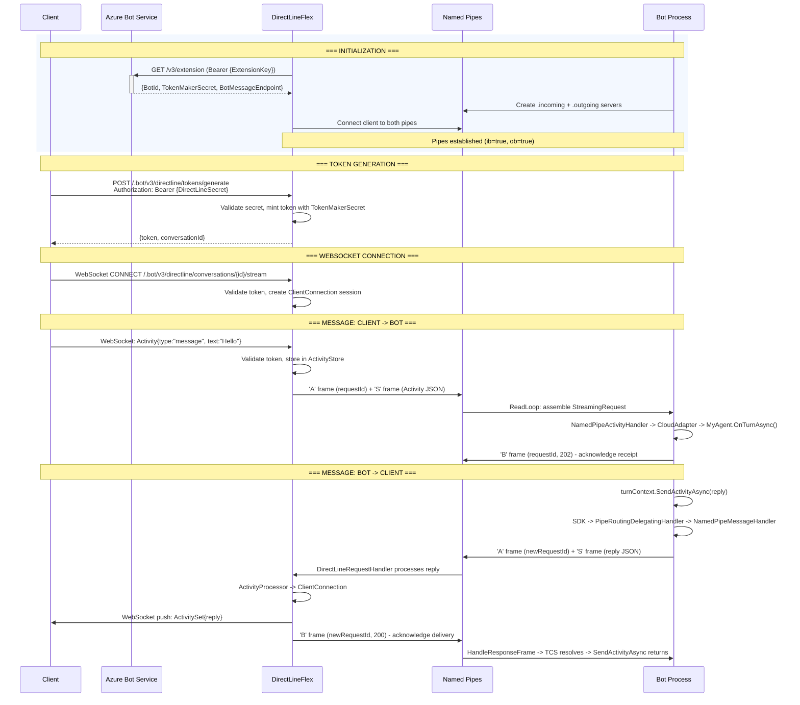

# Microsoft.Agents.Hosting.DirectLine.NamedPipes

Named pipe transport for the Microsoft Agents SDK, enabling agents to communicate with DirectLineFlex (Azure App Service sidecar) over named pipes without HTTP roundtrips.

For Azure App Service setup and troubleshooting guidance, see [Enable Direct Line App Service extension for a .NET bot](https://learn.microsoft.com/en-us/azure/bot-service/bot-service-channel-directline-extension-net-bot). That article targets Bot Framework SDK v4; for Microsoft Agents SDK apps, use `AddAgentNamedPipeTransport` instead of the Bot Framework `UseNamedPipes` middleware shown there.

## Usage

```csharp
var builder = WebApplication.CreateBuilder(args);

builder.AddAgent<MyAgent>();
builder.AddAgentNamedPipeTransport(); // default pipe name: "bfv4.pipes"

var app = builder.Build();
app.MapAgentApplicationEndpoints();
app.Run();
```

## How It Works

When deployed in Azure App Service with DirectLineFlex, the agent communicates via a pair of named pipes (`{pipeName}.incoming` and `{pipeName}.outgoing`) using the Bot Framework wire protocol (48-byte ASCII framed headers with JSON payloads).

- **Inbound**: Activities arrive over the pipe and are dispatched to the agent's turn pipeline via `IChannelAdapter.ProcessActivityAsync`.
- **Outbound**: Reply activities sent via `ITurnContext.SendActivityAsync` are routed back through the pipe (intercepting `urn:botframework:namedpipe:*` service URLs).

## DirectLineFlex Flow



## Configuration

The pipe name defaults to `"bfv4.pipes"` and can be customized:

```csharp
builder.AddAgentNamedPipeTransport(pipeName: "my-custom-pipe");
```

The Bot Framework Direct Line App Service extension configures named pipes with:

```csharp
Environment.GetEnvironmentVariable("APPSETTING_WEBSITE_SITE_NAME") + ".directline"
```

The App Service extension deployment expects that pipe name, configure this library with the same value:

```csharp
var siteName = Environment.GetEnvironmentVariable("APPSETTING_WEBSITE_SITE_NAME");
builder.AddAgentNamedPipeTransport(pipeName: $"{siteName}.directline");
```

The App Service extension also requires the Direct Line channel to be enabled and the App Service application settings `DirectLineExtensionKey` and `DIRECTLINE_EXTENSION_VERSION` to be configured. Enable WebSockets on the App Service, then verify the extension at `https://<app-service-name>.azurewebsites.net/.bot`; successful pipe connection reports `ib: true` and `ob: true`.
